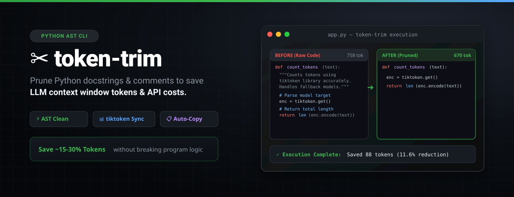

<p align="center">
  
</p>

# token-trim

[](https://pypi.org/project/token-trim-cli/)
[](https://pypi.org/project/token-trim-cli/)
[](https://opensource.org/licenses/MIT)

Intelligently prune Python code and log files to reduce LLM context window usage and lower API costs.

`token-trim` is a lightweight command-line utility built with **Python**, **AST**, **Typer**, **Rich**, and **tiktoken**. It removes unnecessary content such as docstrings, comments, and excess whitespace while preserving valid Python syntax and reporting token savings.

---

## Overview

Large Language Models (LLMs) have limited context windows and often charge based on the number of input tokens. Source files frequently contain comments, docstrings, and formatting that increase token usage without affecting program execution.

`token-trim` removes this unnecessary content, helping you optimize prompts before sending code to an LLM.

---

## Features

* AST-based Python code pruning
* Removes module, class, and function docstrings
* Preserves valid Python syntax, including empty function bodies
* Falls back to line-based cleanup for non-Python files (such as logs)
* Reports token counts before and after pruning
* Calculates token savings and percentage reduction
* Copies pruned output directly to the system clipboard (`-c`, `--copy`)
* Supports recursive directory and batch processing
* Supports in-place file overwriting (`-w`, `--write`)
* Clean and user-friendly command-line interface powered by **Rich** and **Typer**

---

## How It Works

For Python files, `token-trim`:

1. Parses the source code using Python's built-in `ast` module.
2. Traverses the Abstract Syntax Tree (AST).
3. Removes module, class, and function docstrings.
4. Reconstructs valid Python code using `ast.unparse()`.
5. Calculates token counts before and after pruning using `tiktoken`.

If the input is not valid Python, `token-trim` automatically switches to a line-based cleanup that removes comments, blank lines, and unnecessary whitespace.

---

## Installation

### Install from PyPI

```bash
pip install token-trim-cli
```

Verify the installation:

```bash
token-trim --help
```

---

## Usage

### Basic Usage

Prune a Python file or log file.

```bash
token-trim path/to/file.py
```

---

### Copy Output to the Clipboard

Copy the pruned output directly to your system clipboard.

```bash
token-trim path/to/file.py --copy
```

or

```bash
token-trim path/to/file.py -c
```

---

### Overwrite the Original File

Replace the original file with the pruned version.

```bash
token-trim path/to/file.py --write
```

or

```bash
token-trim path/to/file.py -w
```

---

### Specify a Tokenizer Model

By default, `token-trim` uses the `gpt-4o` tokenizer.

Use a different tokenizer model:

```bash
token-trim path/to/file.py --model gpt-3.5-turbo
```

or

```bash
token-trim path/to/file.py -m gpt-3.5-turbo
```

---

### Process an Entire Directory

Recursively prune all supported files within a directory.

```bash
token-trim path/to/folder/
```

---

### View Available Options

```bash
token-trim --help
```

---

## Example Output

```text
╭────────────────────── Token-Trim Execution Complete ──────────────────────╮
│ Original Tokens: 758                                                      │
│ Pruned Tokens:   670                                                      │
│ Tokens Saved:    88 (11.6% reduction)                                     │
│                                                                           │
│ Pruned Output Preview:                                                    │
│                                                                           │
│   1 │ import ast                                                          │
│   2 │ import typer                                                        │
│   3 │ from rich.console import Console                                    │
│   ...                                                                     │
╰───────────────────────────────────────────────────────────────────────────╯
```

---

## Tech Stack

* Python
* AST (`ast`)
* Typer
* Rich
* tiktoken

---

## Contributing

Contributions are welcome.

If you'd like to contribute, please read **CONTRIBUTING.md** for instructions on setting up a development environment, running tests, and submitting pull requests.

---

## License

This project is licensed under the MIT License. See the **LICENSE** file for more information.

```
```
